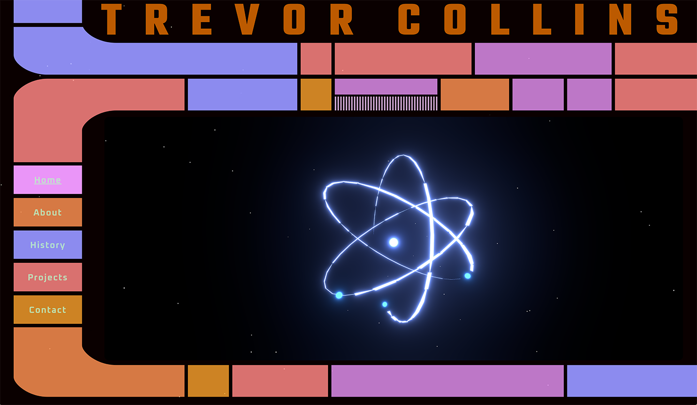
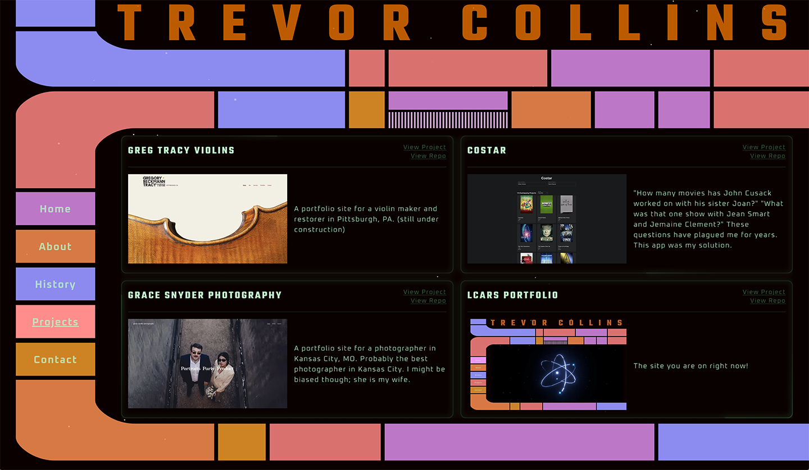
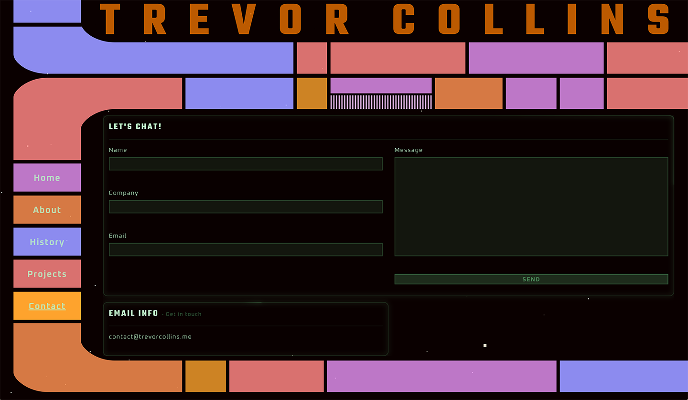
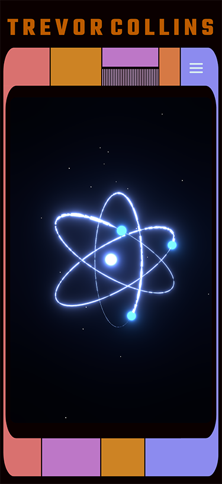
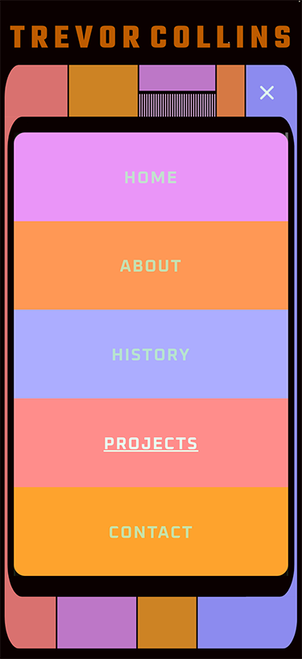
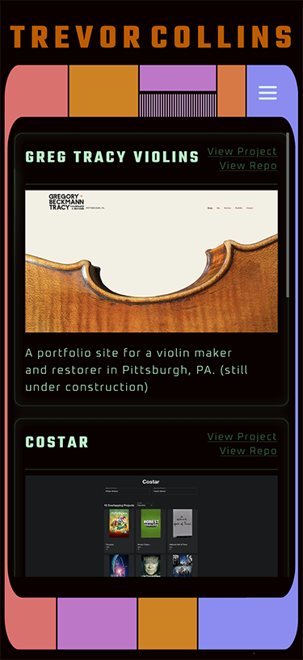
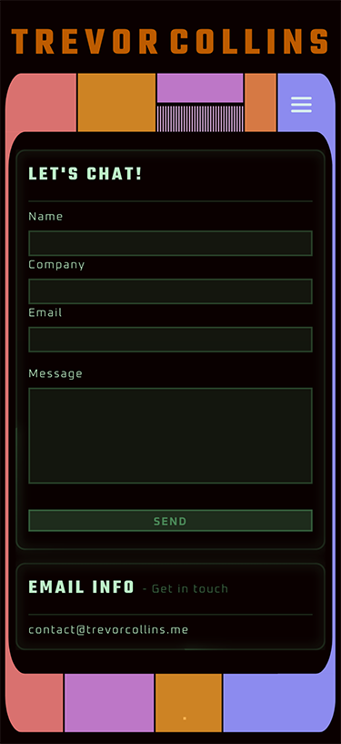

# Trevor Collins - Frontend Developer Portfolio

> "Stellar frontend developer who's continuing mission is to explore strange new frameworks, seek out new libraries, and boldly code where no one has coded before."

A modern, interactive portfolio website inspired by the LCARS (Library Computer Access/Retrieval System) interface from Star Trek. This project showcases advanced frontend development skills through immersive 3D graphics, responsive design, and thoughtful user experience.

## 🚀 Live Demo

[View Portfolio](your-deployed-url-here) <!-- Add your deployed URL -->

## 📸 Screenshots

### Desktop Experience

_LCARS-inspired interface with authentic Star Trek aesthetics_


_Project portfolio with detailed case studies_


_Functional contact form with real-time validation_

### Mobile Experience


_Responsive LCARS interface optimized for mobile devices_


_Touch-friendly navigation with Star Trek-inspired mobile menu_


_Project cards adapted for mobile viewing with swipe gestures_


_Mobile-optimized contact form with improved touch targets_

## ✨ Features

- **LCARS-Inspired Design**: Authentic Star Trek computer interface aesthetic with custom animations
- **3D Interactive Elements**: Three.js integration with React Three Fiber for engaging visual experiences
- **Responsive Layout**: Seamless experience across desktop, tablet, and mobile devices
- **Modern Tech Stack**: Built with Next.js 15, React 19, and TypeScript for optimal performance
- **Contact Integration**: Functional contact form with email capabilities using Resend
- **Performance Optimized**: Custom font loading, image optimization, and efficient rendering

## 🛠 Tech Stack

### Frontend

- **Next.js 15** - React framework with App Router
- **React 19** - Latest React features and concurrent rendering
- **TypeScript** - Type-safe development
- **Tailwind CSS** - Utility-first styling with custom design system

### 3D Graphics & Animation

- **Three.js** - 3D graphics library
- **React Three Fiber** - React renderer for Three.js
- **React Three Drei** - Useful helpers and abstractions
- **Post-processing** - Advanced visual effects

### Forms & Validation

- **React Hook Form** - Performant form handling
- **Zod** - Runtime type validation
- **Hookform Resolvers** - Form validation integration

### Email & Communication

- **React Email** - Modern email templates
- **Resend** - Reliable email delivery service

### Development Tools

- **ESLint** - Code linting with Next.js config
- **Prettier** - Code formatting with Tailwind plugin
- **pnpm** - Fast, efficient package management

### Deployment & CI/CD

- **Vercel** - Zero-config deployment with automatic previews
- **GitHub Integration** - Automatic deployments on push to main
- **Edge Functions** - Serverless API routes for contact form
- **Analytics** - Built-in performance monitoring

## 🏗 Project Structure

```
├── app/
│   ├── _components/          # Reusable UI components
│   │   ├── LCARS/           # Star Trek interface components
│   │   ├── HomeAtom/        # 3D atom visualization
│   │   └── Space/           # Background space effects
│   ├── _lib/                # Utilities and types
│   ├── about/               # About page
│   ├── contact/             # Contact form
│   ├── projects/            # Project showcase
│   └── timeline/            # Career timeline
├── emails/                  # Email templates
└── public/                  # Static assets
```

## 🚀 Getting Started

### Prerequisites

- Node.js 18+
- pnpm (recommended) or npm

### Installation

1. Clone the repository

```bash
git clone [your-repo-url]
cd [your-repo-name]
```

2. Install dependencies

```bash
pnpm install
```

3. Set up environment variables

```bash
cp .env.local.example .env.local
# Add your Resend API key and other environment variables
```

4. Run the development server

```bash
pnpm dev
```

5. Open [http://localhost:3000](http://localhost:3000) in your browser

## 🎨 Design Philosophy

This portfolio demonstrates several key frontend development principles:

- **User Experience First**: Intuitive navigation with visual feedback
- **Performance Optimization**: Lazy loading, code splitting, and efficient rendering
- **Accessibility**: Semantic HTML, keyboard navigation, and screen reader support
- **Responsive Design**: Mobile-first approach with progressive enhancement
- **Modern Architecture**: Component-based design with separation of concerns

## 📧 Contact Integration

The contact form features:

- Real-time validation with user-friendly error messages
- Spam protection and rate limiting
- Professional email templates
- Reliable delivery through Resend API

## 🔧 Development Scripts

```bash
pnpm dev          # Start development server with Turbopack
pnpm build        # Build for production
pnpm start        # Start production server
pnpm lint         # Run ESLint
pnpm email        # Preview email templates
```

## � Deployment & CI/CD

This project leverages Vercel's platform for seamless deployment and continuous integration:

### Automated Deployment Pipeline

- **GitHub Integration**: Automatic deployments triggered on every push to main branch
- **Preview Deployments**: Every pull request gets its own preview URL for testing
- **Zero Downtime**: Atomic deployments ensure the site is always available
- **Instant Rollbacks**: Quick reversion to previous deployments if needed

### Performance & Monitoring

- **Edge Network**: Global CDN for optimal loading speeds worldwide
- **Core Web Vitals**: Automatic monitoring of performance metrics
- **Real User Monitoring**: Analytics on actual user experience
- **Lighthouse Scores**: Continuous performance auditing

### Environment Management

- **Environment Variables**: Secure handling of API keys and secrets
- **Branch Environments**: Different configurations for development, staging, and production
- **Custom Domains**: Professional domain setup with SSL certificates

## 📱 Browser Support

- Chrome 90+
- Firefox 88+
- Safari 14+
- Edge 90+

## 🤝 Let's Connect

I'm actively seeking frontend development opportunities where I can contribute to innovative projects and continue growing as a developer.

- **Portfolio**: [https://trevorcollins.me]
- **LinkedIn**: [https://www.linkedin.com/in/trevor50d/]
- **GitHub**: [https://github.com/TrevorCollins]
- **Email**: [contact@trevorcollins.me]

---

_Built with passion for clean code, exceptional user experiences, and the final frontier._ 🖖
